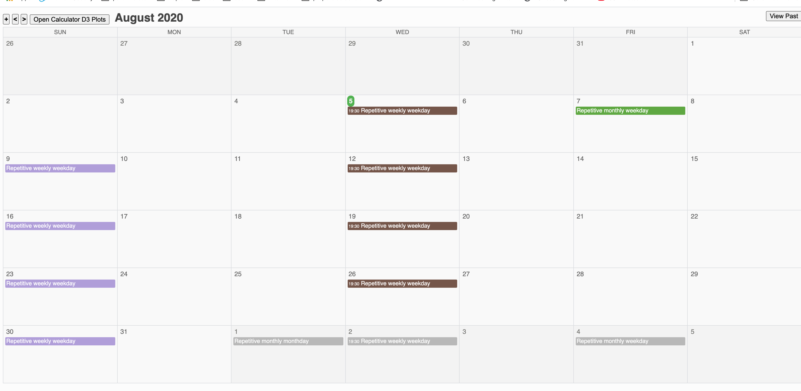
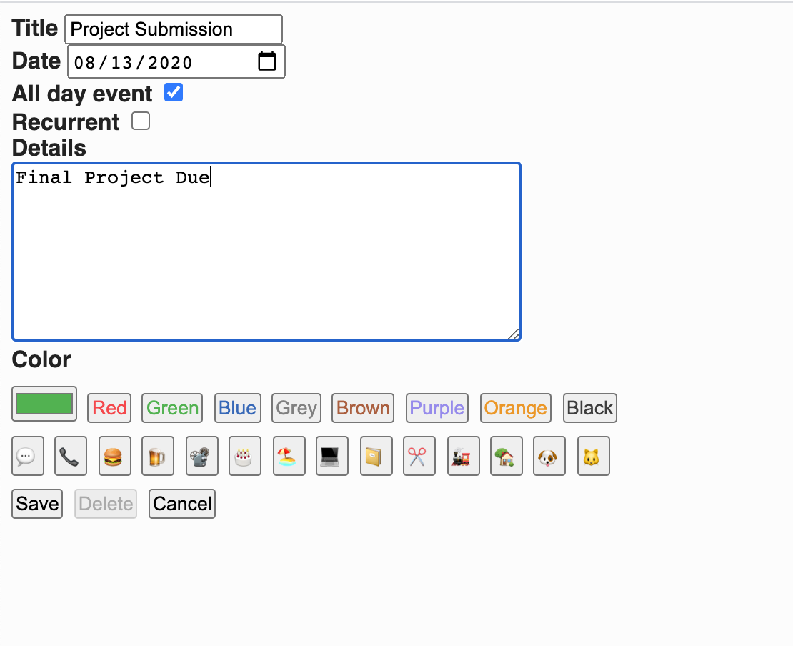

# IS601-850 Final Project
Contributors: Payal Kevin Bhalala, Chinghao Sun and Jeremy Langenderfer

## Introduction
Calendar has used flask-calendar while calculator plots is being setup using d3js library

# Links to Contributor Assigned Tasks
[Feature_1_jl822](https://github.com/Cs586/Team-Project-Final-Web-Application/tree/jl822)  
[Feature_1_Screenshots](https://github.com/Cs586/Team-Project-Final-Web-Application/tree/jl822/Screenshots)    

## Feature 1
Jeremy Langenderfer: Created a calculator with maths function and created Api endpoints using java script chart. Screenshots for the same are also being added.
## Feature 2
Chinghao Sun: Created login and registration process for the project.
## Feature 3
Payal Kevin Bhalala: Created calendar with it's function using docker and also added function to the calender like adding task. 

# flask-calendar

### Details

Main calendar view:

Create new task view:

Supports a basic drag & drop on desktop of days (like Google Calendar), edition of existing tasks, creation of repetitive tasks (daily, montly, by weekday, by month day or on specific day number), custom colors, and a few options like hiding past tasks or being able to manually hide those repetitive task ocurrences (I like a "clean view" and usually remove/hide past tasks).

It is mobile friendly (buttons for actions are ugly and cannot drag & drop days on mobile, but otherwise works), might not be perfectly designed for all resolutions but at least works.

## Docker Environment

- Development strongly encourages using Docker and Docker Compose.

### Running
For running docker compose: build/dev/docker-compose.yml

Sample username is `a_username` with password `a_password`.

